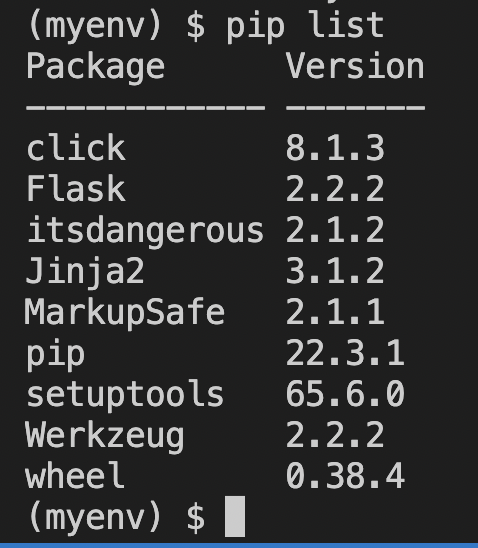

# Todo-app-Flask
Aplicación de Flask para crear, editar, borrar y ver notas (todos) de cosas por hacer.


## Todo app

Aplicación de notas de cosas por hacer. Se debe poder crear notas, editarlas, borrarlas, marcarlas como completadas, etc. Login para ver las notas de cada usuario. Registro para iniciar sesión como usuario. 
- [ X ] Crear unos mocks o diseños de la app
- [ X ] Crear un repositorio en GitHub para el proyecto
- [ ] Crear un proyecto de Flask para conectar con la base de datos -> API
- [ home ] Creamos el front con vistas desde Flask
- [ ] Vistas: Login, Registro, Inicio/Home, Crear nota, Editar nota, Borrar nota, Notas completadas, Notas pendientes
- [ ] Valorar: añadir tags o categorías para clasificar las notas
- [ ] Valorar: añadir un buscador para buscar notas por título o contenido

### Stack

- Diseños: Canva / Figma
- Control de código: GitHub / Git
- Backend: MySQL, Flask, Python
- Frontend: HTML, CSS, JS, Bootstrap
- Despliegue: Fleek.co


## Diseño
Diseño inicial como sitio web en Canva. [Notas app](https://notas-app.my.canva.site/)
### Plantillas de Canva
- [Logo cuadrado de 500x500](https://www.canva.com/design/DAFVekshKYE/Aff168TLplloOTraEBlrmQ/view?utm_content=DAFVekshKYE&utm_campaign=designshare&utm_medium=link&utm_source=publishsharelink&mode=preview)
- [Logo rectangular de 500x250](https://www.canva.com/design/DAFVekmfN_g/sFe582vT5ptD5YkqcE9sNA/view?utm_content=DAFVekmfN_g&utm_campaign=designshare&utm_medium=link&utm_source=publishsharelink&mode=preview)
- [Logo rectangular de 500x125](https://www.canva.com/design/DAFVegLPYSc/4o8lbWx29QSYABXxeBp-7A/view?utm_content=DAFVegLPYSc&utm_campaign=designshare&utm_medium=link&utm_source=publishsharelink&mode=preview)
- [Plantilla del sitio web en Canva](https://www.canva.com/design/DAFVecOVvXY/SLaoMm8UE0LITce1YJEb5w/view?utm_content=DAFVecOVvXY&utm_campaign=designshare&utm_medium=link&utm_source=publishsharelink&mode=preview)

### Paleta de colores

- [Paletton](https://paletton.com/#uid=30C0u0klMuCc6LyhuAUqFsmt5mh)

#### Amarillo Primario

- Nota: estos azules son un poco oscuros asi que por ahora estamos colocando este otro: #2A6EF2

#FFD29F
RGB: 255–210–159
RGB [%]: 100–82.4–62.4

#FFBD74
RGB: 255–189–116
RGB [%]: 100–74.1–45.5

#F4A64E
RGB: 244–166–78
RGB [%]: 95.7–65.1–30.6

#E28926
RGB: 226–137–38
RGB [%]: 88.6–53.7–14.9

#B16510
RGB: 177–101–16
RGB [%]: 69.4–39.6–6.3

#### Azul Secundario #1
#919BD8
RGB: 145–155–216
RGB [%]: 56.9–60.8–84.7

#6470BE
RGB: 100–112–190
RGB [%]: 39.2–43.9–74.5

#4452A7
RGB: 68–82–167
RGB [%]: 26.7–32.2–65.5

#2B3A9B
RGB: 43–58–155
RGB [%]: 16.9–22.7–60.8

#19277A
RGB: 25–39–122
RGB [%]: 9.8–15.3–47.8

#### Verde Secundario #2
#89DCAB
RGB: 137–220–171
RGB [%]: 53.7–86.3–67.1

#59C585
RGB: 89–197–133
RGB [%]: 34.9–77.3–52.2

#38AF68
RGB: 56–175–104
RGB [%]: 22–68.6–40.8

#1BA252
RGB: 27–162–82
RGB [%]: 10.6–63.5–32.2

#0C803B
RGB: 12–128–59
RGB [%]: 4.7–50.2–23.1

### Fuentes

- Título principal o título en logo: [Tomorrow](https://fonts.google.com/specimen/Tomorrow) - 400
- Subtítulo en logo o h2: [Poppins Medium](https://fonts.google.com/specimen/Poppins?query=poppins) - 500
- Texto: [Poppings Regular](https://fonts.google.com/specimen/Poppins?query=poppins) - 400

## Flask

### Instalación de pyenv + Entorno virtual con venv

- [Post](https://dev.to/dendihandian/pyenv-in-windows-4lpe) sobre cómo controlar las versiones entre proyectos en Python con Windows. **Nota: mirar los dos primeros posts de la serie o el primero.**
- [pyenv-win](https://pyenv-win.github.io/pyenv-win/) -> Instalación de pyenv en Windows

**Mac OS**
Con brew:
```
brew install pyenv
```
[Versiones estables en Mac OS](https://www.python.org/downloads/macos/)
```
pyenv install 3.10.9
```
Instalamos `pyenv-virtualenv`
```
brew install pyenv-virtualenv
```
```
pyenv virtualenv 3.10.9 venv_todo_app
```
Activamos el entorno virtual
```
pyenv activate venv_todo_app
```
**Nota:** Si aparece el siguiente error:
```
Failed to activate virtualenv.

Perhaps pyenv-virtualenv has not been loaded into your shell properly.
Please restart current shell and try again.
```
hay que realizar los [pasos de cargar pyenv en el shell](https://github.com/pyenv/pyenv#set-up-your-shell-environment-for-pyenv):

(En mi caso es `zsh`)
```
echo 'export PYENV_ROOT="$HOME/.pyenv"' >> ~/.zshrc
echo 'command -v pyenv >/dev/null || export PATH="$PYENV_ROOT/bin:$PATH"' >> ~/.zshrc
echo 'eval "$(pyenv init -)"' >> ~/.zshrc
```
Reiniciar el terminal para que los cambios tengan efecto:
```
exec "$SHELL"
```
Probamos a activar el entorno virtual de nuevo:
```
pyenv activate venv_todo_app
```
**Nota: mirar los dos primeros posts de la serie o el primero.**

**Ubuntu**
Vamos a realizar los pasos en el servidor `Formacion-POO`
- Primero, hacemos snap o backup del servidor.
- Instalamos pyenv. [Post con los pasos para Ubuntu.](https://itslinuxfoss.com/install-use-pyenv-ubuntu/)
```
sudo apt update
curl https://pyenv.run | bash
```
**Nota:**
- Si aparecen errores o problemas de dependencia ejecutad estos comandos:
```
sudo apt install curl -y 
sudo apt install git -y
```
Añadimos variable de entorno para bash:
```
export PATH="$HOME/.pyenv/bin:$PATH" && eval "$(pyenv init --path)" && echo -e 'if command -v pyenv 1>/dev/null 2>&1; then\n eval "$(pyenv init -)"\nfi' >> ~/.bashrc
```
Reiniciamos el shell de bash:
```
exec $SHELL
```
Comprobamos instalación con:
```
pyenv --version
```
Debe salir el número de versión de pyenv.
**Windows**
[Repositorio de pyenv-win](https://github.com/pyenv-win/pyenv-win)
[Métodos de Instalación de pyenv-win en Windows](https://github.com/pyenv-win/pyenv-win#installation)
pendiente

### Una vez pyenv se ha instalado

Podemos ver las versiones disponibles de Python:
```
pyenv install --list
```
Para ver las versiones instaladas:
```
pyenv versions
```
Instalamos la versión estble de `Python 3.10.9`:
```
pyenv install 3.10.9
```
Comprobamos versiones instaladas de Python con pyenv:
```
pyenv versions
```
Creamos un entorno virtual con la versión de Python que queramos:
```
pyenv virtualenv 3.10.9 venv_todo_app
```
Ver entornos creados:
```
pyenv virtualenvs
```
**Activar entorno**
```
pyenv activate venv_todo_app
```
**Desactivar entorno**
```
pyenv deactivate
```
**Nota:** 
- Si aparece el error, [seguir estos pasos](https://github.com/pyenv/pyenv-virtualenv#installation).
- Si no encuentra `pyenv`, [revisar este hilo](https://github.com/pyenv/pyenv-installer/issues/112). 
- [Cambiar ExecutionPolicy en Windows](https://www.alexmedina.net/habilitar-la-ejecucion-de-scripts-para-powershell/)

    - Abrir PowerShell como administrador
    - Ejecutar el siguiente comando:
    ```
    Get-ExecutionPolicy
    ```
    Si sale Restricted o RemoteSigned, cambiar a Unrestricted para la instalación:
    ```
    Set-ExecutionPolicy Unrestricted
    ```
    Aceptamos cambio con `S` o `s`.
    **Instalad pyenv con el siguiente comando:**
    ```
    yenv-win/master/pyenv-win/install-pyenv-win.ps1" -OutFile "./install-pyenv-win.ps1"; &"./install-pyenv-win.ps1"
    ```
    **Volved a cambiar el ExecutionPolicy a Restricted:**
    ```
    Set-ExecutionPolicy Restricted
    ```
    Aceptamos cambio con `S` o `s`.
    ```
    Get-ExecutionPolicy
    ```
    Debe salir `Restricted`.

## Flask
- Abrimos venv con `pyenv activate venv_todo_app` o `Scripts\activate`
- Instalamos Flask:
```
pip install Flask
```
- Creamos el archivo `app.py`:
```python
    from flask import Flask

    app = Flask(__name__)

    @app.route("/")
    def hello():
        return "Hello, World!"
```
- Guardar. Y para ejecutar la app de Flask (desde la misma ubicación de `app.py`):
```
flask run
```
Debe salir un `Hello, world` en el navegador:


Siguientes pasos en [Flask](./docs/flask.md)

## Despliegue en desarrollo

- [PM2 para Flask](https://blog.jcharistech.com/2022/01/14/managing-python-flask-app-with-pm2/)
- [Despliegues](https://smirnov-am.github.io/deploy-flask/)

### Entorno virtual usando pyenv
Por el momento, hay que ejecutar este comando para acceder a `pyenv`:
```bash
export PATH="$HOME/.pyenv/bin:$PATH" && eval "$(pyenv init --path)" && echo -e 'if command -v pyenv 1>/dev/null 2>&1; then\n eval "$(pyenv init -)"\nfi' >> ~/.bashrc
```
```bash
exec $SHELL
```
Para ver los entornos disponibles o creados:
```
pyenv virtualenvs
```
Para crear un entorno virtual:
```
pyenv virtualenv 3.10.9 nombre_del_entorno
```
Para activar el entorno virtual:
```
pyenv activate nombre_del_entorno
```
### Entorno virtual usando virtualenv o venv
- Navegamos a la ubicación para el entorno.
- Creamos el entorno virtual:
```
virtualenv nombre_del_entorno
```
- Activamos el entorno virtual:
**Como usuario normal:**

```
sudo su - nombre_usuario
```

```
cd ubicación_entorno
```

**Como usuario normal:**
```
. ./bin/activate
```
Instalar flask:
```
pip install flask
```
Para generar `requirements.txt`:
```
pip freeze > requirements.txt
```
Para instalar librerías de `requirements.txt`:
```
pip install -r requirements.txt
```
Para ver las librerías instaladas (debe salir flask y algunas más):
```
pip list
```

Si queremos iniciar la app de `app.py`:
```
python3 app.py
```
o bien:
```
flask run
```
**Como root:**
Activar entorno virtual:
```
source bin/activate
```
Para desactivar entorno virtual:
```
deactivate
```
## PM2
Hemos editado `app.py` para que salga por el IP del servidor: `IP:puerto/rutas`:
```python
# 5000
if __name__ == '__main__':
   app.run(host="0.0.0.0", port=5000, debug = True)
```
**-> Cambiad el puerto a uno que esté libre si no: ¯\\\_(シ)_/¯ <-**

Hemos añadido el servicio a PM2 con:
```
pm2 start app.py --interpreter python3 --name nombre-carpeta-puerto
```

## MySQL
- Para acceder a MySQL:
```
mysql -p
```
- Pide contraseña (super segura)
- Ver bases de datos:
```
SHOW databases;
```
- Seleccionar base de datos:
```
USE nombre_base_datos;
```
- Queries:
```
SELECT * FROM nombre_tabla;
```